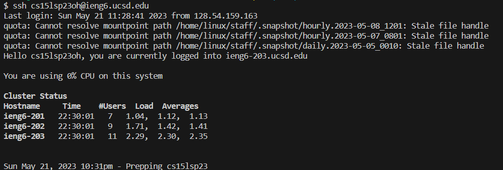
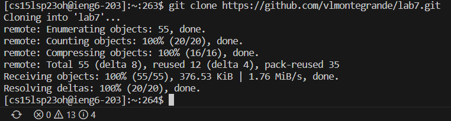
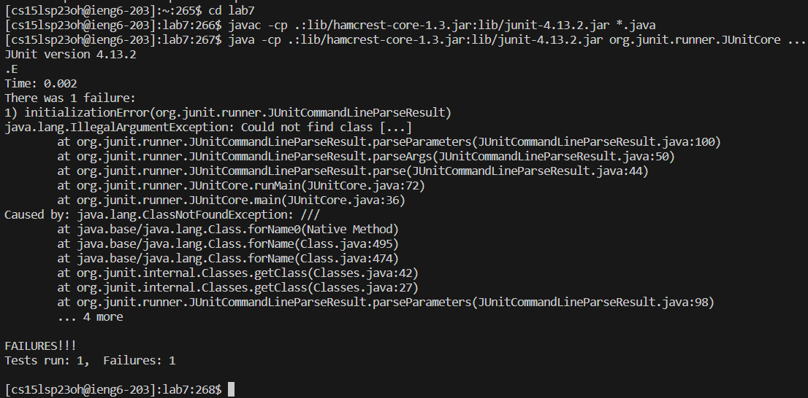
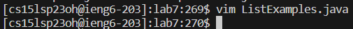
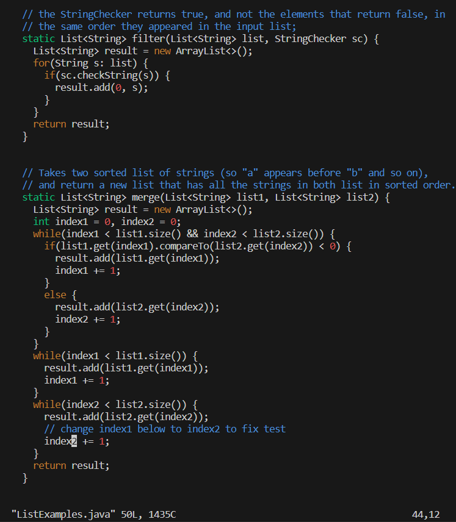
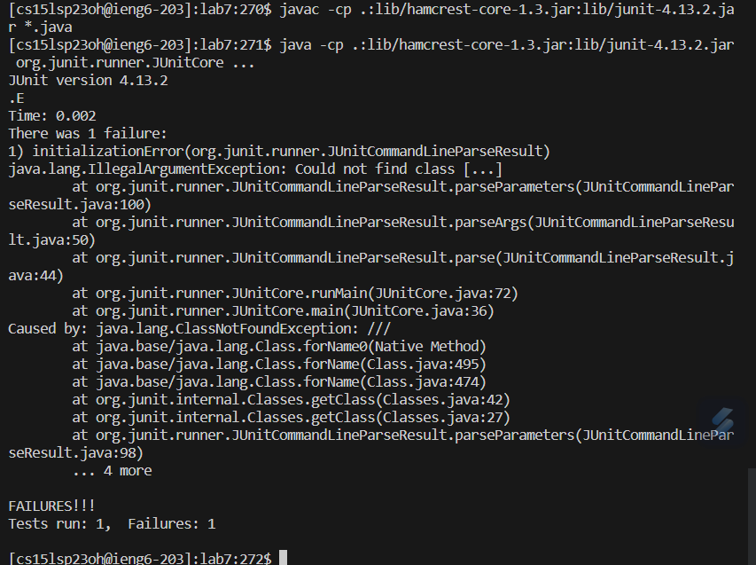
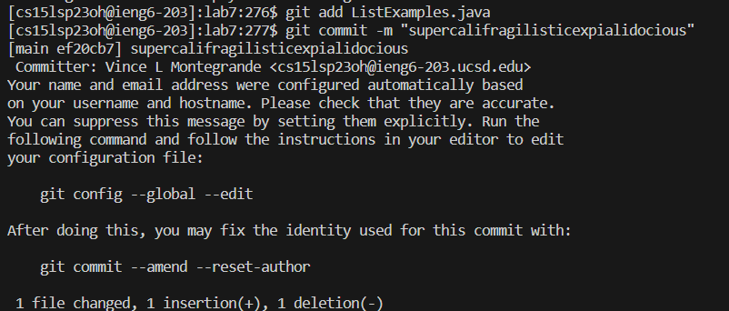
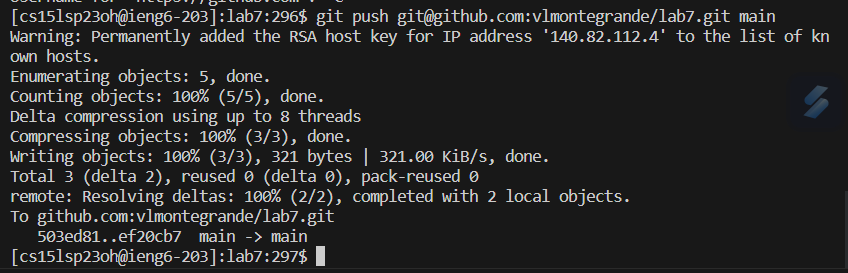

# Lab Report 4

Hey guys! Here I am again. We're gonna go through working with git and remote servers!!!! Yayyyyy!!! 

oh no

it's coming


ḭ̸̢̛̛̟̦͉̞͉͑̄̇͗̿̏͌̎̎̕͝͠ ̶̹̖͗͐̒͊͝͠ľ̸̨̨̲͖̭͓͎͈͇̻̯́̔̌̍̌̂̈́͐̇͜ḯ̵̢̡̲̘̻̥̯̲̭̹̼͙͓̾̏́̈́͆v̴̧̡̝̮͚͇̰̹͎͓̦̲͈̏͒͒͜e̷̮̥̳̝͓̽̎͒͒͆́̔͐̈́̍̈͘͜ ̶̥̣̭͛͗̅̆͜ȋ̸͙̥̻̲̞͕̗̳̘̦̹̜̼̼̝͕̀̊̇̽̑̀͌̂̕ń̶̥̩̟̲̖͍̬̌̀̋́̌̀̈́͊̉̓͐͂̚̕ͅ ̷̛̞̫͙͙̗̫͈̄̽̈͛̑͛̆̈́̊̒̀̂̕͝y̵̤͎͍̫̯̺̗̫̫̺̦̻͌͂͛̌̑̇̽͐̌͂͗̌͆̊͝͝ó̴͈̬̠̦̣̗̃̒͘ư̷̧̢̛͚̻͎̥̩̺̲̘̎̓̐̀̊͋̉̉̎̈́̿̓̕͠͝r̶͚̬̻͚̩͍̠͓̦͖͆͐̒̎̏̇̅͊͐̒̋̀́̂͘͠͠ ̶̡̡̢̖̘̟̹̱̠̥̩̻̙̞̱̋͗̉̌̄̆̍͂̅̀́̾͂͝͝͝w̷̨̡̝̘̯͓̜͖͍̳̰̜̣̫͎̻͒͜ą̷̨̨̮̜͈̻̖̝͈̮͐̄̑̈̊̋͛̿̍̚ḽ̵̩̝̘̘͕͖̠̰̮̥̦͇̳̒̄͑͑̒̋͛͋͝l̴͙̲̞̣̲̳̀̊s̴̢̢̟̪̫̰̝̰̙̯̲͍̩̰̎̈̏̽̊̐͆͌̿̈́̄͝

---

# Log into ieng6: `<up> <enter>` 

*The ssh command of `ssh cs15lsp23oh@ieng6.ucsd.edu` was the last command I executed, using the up arrow I was able to get to it efficiently.*



  
# Clone your fork of the repository from your Github account: `git clone https://github.com/vlmontegrande/lab7.git <enter>`

*I had to manually type the git clone command, copying and pasting the GitHub URL from the GitHub repository page*




# Run the tests, demonstrating that they fail:
```
cd lab7 <enter>
javac -cp .:lib/hamcrest-core-1.3.jar:lib/junit-4.13.2.jar *.java <enter>
java -cp .:lib/hamcrest-core-1.3.jar:lib/junit-4.13.2.jar org.junit.runner.JUnitCore ... <enter>
```

*I had to manually type these too, as I didn't have any of them saved in my command history.*




# Edit the code file to fix the failing test:
```
vim L <tab> . <tab> <enter>
?i <enter>
5l
r2
:wq <enter>
```

*I used a lot of shortcuts in this step. The first line of the code block above, I used tabs to search for the file ListExamples.java in the directory. When I used vim to get in their, my second line showed that I searched from the bottom for index1. The ? operator is a search from the bottom in vim.*
*Using 5l I moved straight to the 1 in index1. Using r2 I instantly replaced 1 with 2. Finally, with :wq I saved the file and exited.*








# Run the tests, demonstrating that they now succeed:
```
<up><up><up><up><enter>
<up><up><up><up><enter>
```


*With these I just used the command history to reach the `javac -cp .:lib/hamcrest-core-1.3.jar:lib/junit-4.13.2.jar *.java` and `java -cp .:lib/hamcrest-core-1.3.jar:lib/junit-4.13.2.jar org.junit.runner.JUnitCore ...` commands. They were both four commands up.*





# Commit and push the resulting change to your Github account (you can pick any commit message!):
```
git add ListExamples.java <enter>
git commit -m "supercalifragilisticexpialidocious" <enter>
git push git@github.com:vlmontegrande/lab7.git main <enter>
```


*All of these I had to type manually. I added ListExamples.java to put it in the staging area, I committed the change, and I pushed the repository to GitHub.*






